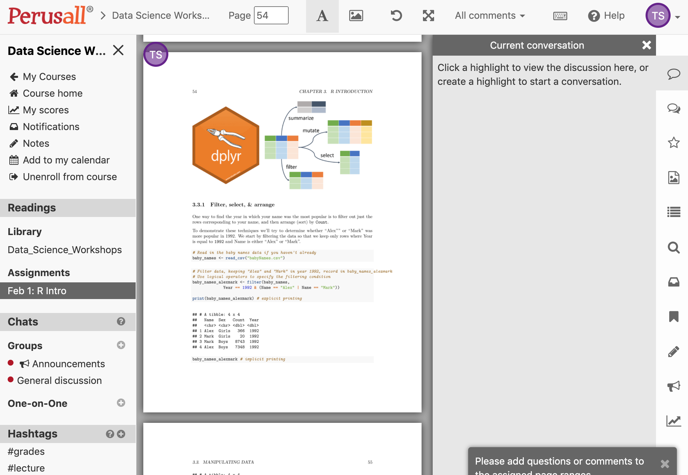

# What is Perusall? {-}

[Perusal](https://perusall.com/) is a browser-based software platform for interactive learning. Students help each other learn by collectively annotating readings in threads, responding to each other’s comments, and interacting. Perusall can bring the interactivity of a small seminar to a larger course.

## Why are we using Perusall? {-}

Some of our Data Science Workshops are being taught using a "flipped classroom" model --- this is where lecture-based material is delivered online, asyncronously, so that it can be digested at your own pace, which provides more time for Q&A discussion during in-class time. 

Prior to our Zoom-based one-hour Q&A session, there will be a **two week self-study period** during which you can work through the workshop materials at your own pace. We are using Persuall as a means to facilitate greater engagement with the workshop materials during this self-study period. With Perusall, you will be able to post questions and comments about parts of the materials you do not understand or problems you encounter. Instructors can answer your questions and comments, but you will also have the opportunity to reply to questions and comments from other participants. In this way, Perusall facilitates peer-to-peer and peer-to-instructor learning.

**Your successful completion of the workshop will be based on making a contribution, via questions and comments, during this self-study period.**

# How to use Perusall? {-}

You should have received an email asking you to create an account at <https://perusall.com/>. You should also have receive a **course code** via email. If you have not, please contact your workshop administrator. Once your Perusall account is created, enter the course code and you will be able to view the course materials. 

During the two week self-study period, you can highlight sections of the workshop materials you wish to ask questions about, add comments, as well as respond to questions and comments from other participants. The window for submitting questions will close 24 hours prior to the Zoom Q&A session.

## My courses

Once you have logged into Perusall and entered your course code, you should see the name of the workshop you have registered for listed under `My courses` (highlighted in red in the image below). 

Click on the name of the workshop to proceed.

## Get started

You will now enter the `Course home` page, under the `Get started` tab. This page provides some basic information about Perusall. At the top of the page, there are two other tabs --- `Library` and `Assignments`. Click on the latter (highlighted in red in the image below).

## Assignments

You will now enter the `Assignments` page. For your workshop, there will be only one assigment. To start working on the assignment, click on the `Work on assignment` button (highlighted in red in the image below).

You will enter a new page and be presented with a popup window of instructions. Once you've read the instructions, click `End tour` in the bottom right of the popup (highlighted in red in the image below).

## Layout

You will now enter a new page where the main screen is divided into a left and right panel. On the left, you can view the workshop materials as a pdf file. You can scroll through the materials as you work on them. On the right, you will see a panel called `Current conversation`, which should be blank.

You're now ready to start! You can work through the materials at your own pace.

## Ask a question

As you work through the materials, you may have questions or comments about the content. You can ask a question or make a comment by simply highlighting the part of the text that you'd like to refer to (see highlighted code chunk in left side panel below). Once the text is highlighted, a text window opens in the right side `Current conversation` panel (highlighted in red in the image below). You can type your question here. Your question could be in plain English, or include code. 

Once you have finished typing your question press enter/return. Your question will now be visible to the instructor and other workshop participants. Don't be shy --- **there are no stupid questions!!!**

## Answer a question

If you see a comment or question that you can help with, please try to answer it yourself! There will be a text window under the most recent part of the conversation thread, which you can write your reply in (highlighted in red in the image below). This is a great way to learn, since we often learn best by teaching others. Feel free to ask as many additional questions as your want within the same conversation thread.

The above process repeats itself whenever you reach part of the materials you have a question about: `highlight text` -> `type question`. 

# Zoom-based Q&A session {-}

After the two-week self-study period, we will host a one-hour live Q&A session via Zoom. No new material will be presented during this session -- rather, this will be an additional opportunity to ask questions and get feedback about the materials. The instructor will use the questions submitted on Perusall as a starting point for discussion and possibly for short code demonstrations illustrating conceptual or syntactical stumbling blocks. 

**Zoom etiquette:** Pleasure be punctual. All participants will initially be entered into a Zoom waiting room and the presenter will admit them to the session at the designated start time. Any participants arriving in the wait room more than 5 mins past the listed start time of the session will not be admitted. 

